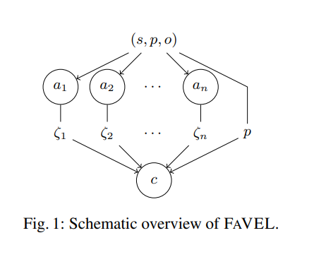
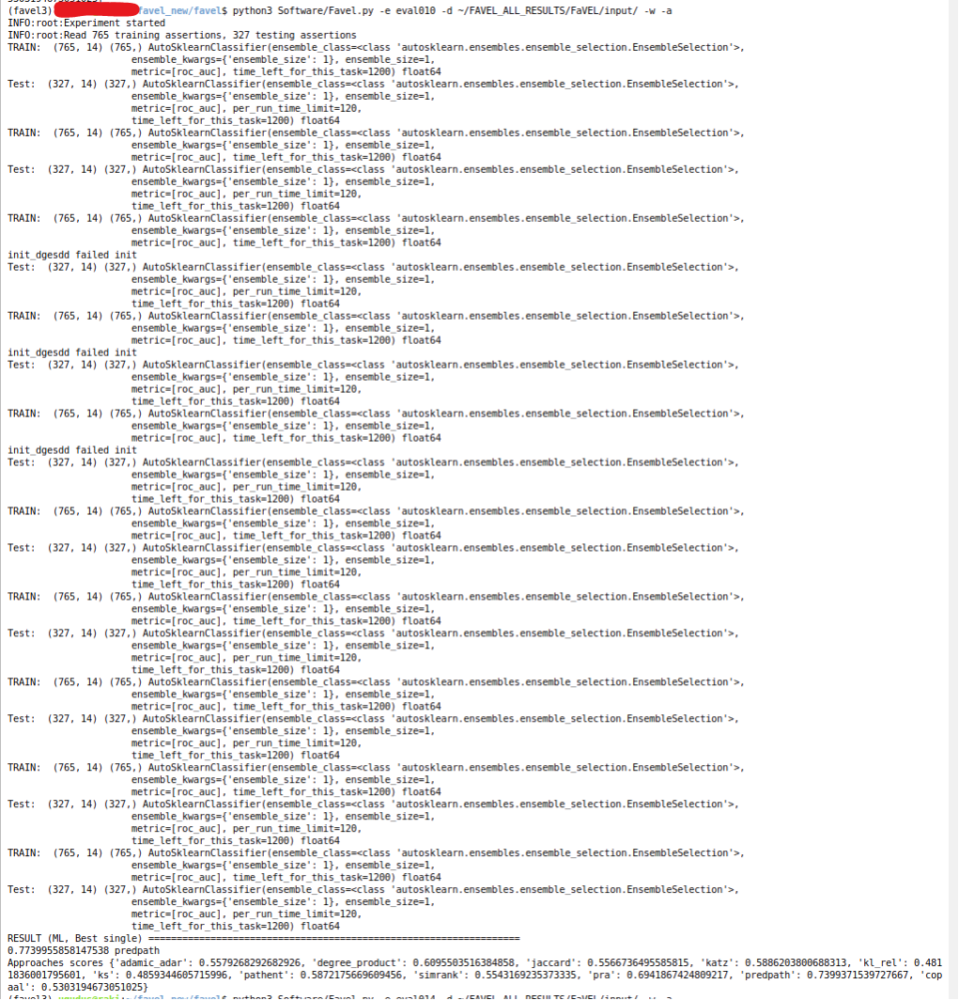
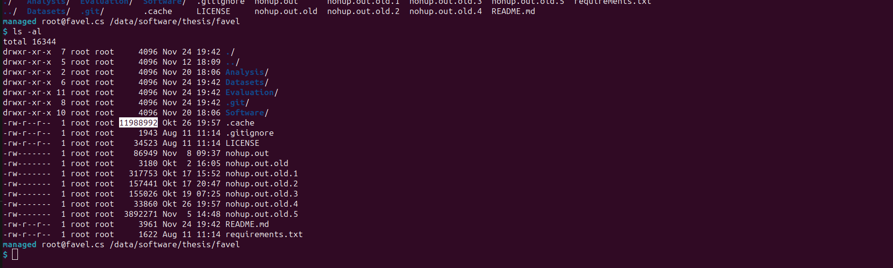
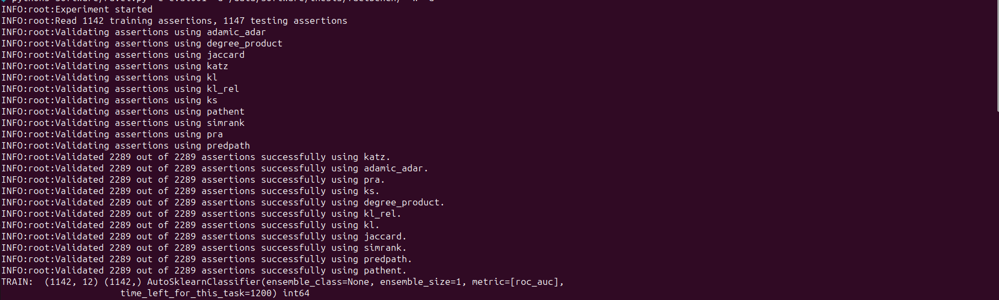

FAVEL
=
<i>Fact Validation Ensemble Learner</i>



We present FAVEL, a fact-checking approach that relies on ensemble learning to
combine several knowledge-graph-based fact-checking approaches.
It is based on an ensemble learning algorithm to combine the prediction results of the different fact-checking
approaches. The vision of this project is to explore the possibility to train a supervised machine learning algorithm based on the results of several fact validation approaches.

To achieve this vision this project offers:
* A software which can automatically
    1. Validate a dataset on multiple fact validation approaches
    2. Use the results of the fact validation approaches to train a supervised machine learning algorithm
    3. Validate the dataset on the trained machine learning model
* Four datasets that can be used for evaluation are [**here**](Datasets/README.md).

# Structure of the Repository

- [**Analysis**](Analysis): Simple script to plot diagrams based on the data in [**Evaluation/Overview**](Evaluation/Overview.xlsx)
- [**Evaluation**](Evaluation): The software saves results to this directory. It also contains preliminaries results of our experiments.
- [**Datasets**](Datasets): Dataset with simple example.  You can find the documentation [**here**](Datasets/README.md).  
- [**Software**](Software): Software for exploring the vision

# Installation
<details><summary> </summary>

```
git clone https://github.com/dice-group/favel.git
conda create -n "favel" python=3.7
conda activate favel
cd favel
pip install -r requirements.txt
cd favel
```
or 
```
git clone https://github.com/dice-group/favel.git
virtualenv -p python3.7 favel
source favel/bin/activate
pip install -r requirements.txt
cd favel
```
</details>

# Usage

<details><summary> </summary>

* To conduct an experiment with the software execute the following steps:
    1. Create a directory inside the Evaluation directory.\
        The name of the directory is the name of the experiment \
        Example: ```favel/Evaluation/experiment42```
    2. Create a configuration file ```favel.conf``` inside the experiment directory. \
        The configuration file defines the set of fact validation approaches and the machine learning algorithm. \
        A basic configuration file is can be found [**here**](Evaluation/example/favel.conf). \
        For more advanced configuration options look [**here**](Software/MLService/README.md). \
        Example: ```favel/Evaluation/experiment42/favel.conf```
    3. Execute the software. \
        For the software to be able to use fact validation approaches, these approaches might have to be started manually. \
        An exaustive description how to run the software can be found in the following section. \
        Results will be saved to the [**favel/Evaluation/**](Evaluation) directory. \
        Example: ```python3 favel/Software/Favel.py -d favel/FinalDataset_Hard -e experiment42```

</details>

## How to run

```
python3 Software/Favel.py [options]
```

### Options

<details><summary> </summary>

* ```-e EXPERIMENT, --experiment EXPERIMENT``` name of the experiment, corresponds with the name of the experiment folder in the ```Evaluation``` directory
* ```-b EXPERIMENT, --batch EXPERIMENT``` name of the experiment, corresponds with the name of the experiment folder in the ```Evaluation``` directory.
Experiment will be run in batch mode, meaning that an experiment will be executed with every subset of the specified set of fact validation approaches.
* ```-d DATA, --data DATA``` path to the dataset to validate
* ```-w, --write``` write everything to disk. If this flag is set, all possible outputs are written to disk. This includes models, normalizers, predicate encoders, and dataframes.
If the flag is not set, only the overview is written to disk.
* ```-c, --containers```Automatically Start/Stop containers that encapsulate the fact validation approaches.
* ```-a, --automl``` To use the autoML system instead of the manual algorithm selection.

</details>


## How to test

```
python3 -m unittest
```

## How to run using pre-computed fact-validation approaches veracity scores
<details><summary> </summary>

Pre-computed fact-validation approaches veracity scores in the FAVEL_ALL_RESULTS/FaVEL/input folder 
    
* First activate the environment using the command specified above. 
* FAVEL_ALL_RESULTS.zip file contains the precomputed veracity scores from individual approaches. 
* Unzip this file and run the following command to execute experiments.
* You can change the input config file in the Evaluations/eval001 folder.

```
unzip FAVEL_ALL_RESULTS.zip
python3 Software/Favel.py -e eval001 -d FAVEL_ALL_RESULTS/FaVEL/input/ -w -a
```

Each experiment can take up to 3 hours depending upon no. of iterations in the input config file.


Example:


You can also use the values stored in the .cache.




</details>

# Additional Resources

## Datasets

More informations about included datasets [here](Datasets)
<!-- * [FactBench](https://github.com/dice-group/favel/FactBench-Dataset_2022)
* [BPDP](https://github.com/dice-group/favel/BPDP-Dataset_2022)
* [Favel](https://github.com/dice-group/favel/favel/tree/main/Favel_Dataset)
* [Favel-hard](https://github.com/dice-group/favel/favel/tree/main/FinalDataset_Hard) -->

## Fact Validation Approaches
* <https://github.com/factcheckerr/containers-knowledgestream> offers multiple algorithms

<details><summary> </summary>
Example of running the fact-validation approaches inside docker containers
    


</details>

## Acknowledgements
To be made available soon.
